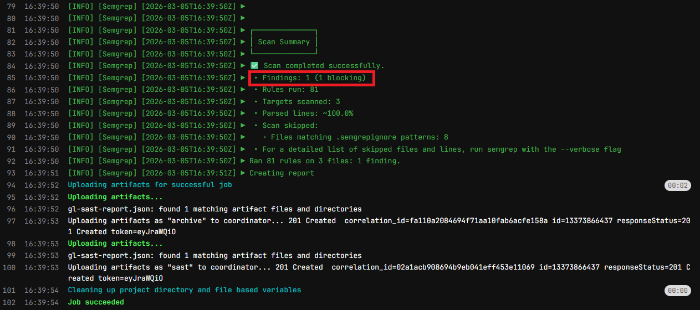
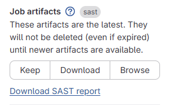

# GitLab SAST Security Scanning

Extends the [compliance pipeline](https://github.com/angie0120/gitlab-compliance-pipeline) with GitLab's built-in SAST scanning using Semgrep, automatically detecting vulnerabilities on every commit.

--- 

### What Was Added
- `vulnerable_app.py` - intentionally insecure Python file containing a SQL injection vulnerability (for demo purposes only)
- SAST stage added to `.gitlab-ci.yml` using GitLab's built-in template

---

### What Semgrep Found
| Field | Detail |
|---|---|
| Vulnerability | SQL Injection |
| Severity | High |
| File | vulnerable_app.py, line 8 |
| Rule | Bandit B608 |
| Standard | CWE-89, OWASP A03:2021 Injection |

---

### How to View the SAST Report
1. Go to **Build → Pipelines**
2. Click the latest pipeline
3. Click the **semgrep-sast** job
4. On the right side under **Job artifacts**, click **"Download SAST report"**
5. Open `gl-sast-report.json` to see full vulnerability details

---

### Key Takeaway
SAST tools catch what their ruleset covers. The scan caught the SQL injection as a High severity finding mapped to OWASP A03:2021, but missed the hardcoded credential, which is a realistic reminder that no single tool catches everything, and layered security controls are essential.

---

### GRC/Compliance Alignment
| Pipeline Behavior | GRC Concept |
|---|---|
| SAST runs on every commit | Continuous security testing vs. point-in-time pen tests |
| High severity finding flagged | Risk identification and prioritization |
| Mapped to OWASP/CWE standards | Compliance framework alignment |
| Artifact report generated | Audit evidence and documentation |

---

## Screenshots
### SAST findings in job log



### Download SAST report location



```json
{
  "name": "Improper neutralization of special elements used in an SQL Command ('SQL Injection')",
  "severity": "High",
  "scanner": {"id": "semgrep", "name": "Semgrep"},
  "location": {"file": "vulnerable_app.py", "start_line": 8}
}
```

---

## How to Replicate this Project

<details>
<summary>Steps to Replicate This Project</summary>

### Prerequisites
- Complete the [GitLab Compliance Pipeline](https://github.com/angie0120/gitlab-compliance-pipeline) project or have a basic GitLab project with a `.gitlab-ci.yml` already set up
- A free GitLab account (sign up at gitlab.com)

### Step 1 — Add the vulnerable app file
1. Open your project in the **GitLab Web IDE**
2. Right-click in the file explorer on the left
3. Select **"New file"**
4. Name it `vulnerable_app.py`
5. Paste the code from [vulnerable_app.py](./vulnerable_app.py)
6. Click **"Commit"** → commit to **main**

### Step 2 — Update the pipeline file
Open `.gitlab-ci.yml` and make two edits:

Add `- sast` to your stages list:
```yaml
stages:
  - validate
  - test
  - report
  - sast
```

Add this block at the very bottom of the file:
```yaml
include:
  - template: Security/SAST.gitlab-ci.yml
```
Commit to **main**

### Step 3 — Watch the pipeline run
1. In the left sidebar, click **"Build"** → **"Pipelines"**
2. You should see a pipeline triggered automatically with 4 stages
3. All stages should pass ✅
4. The `semgrep-sast` job will scan your Python files automatically

### Step 4 — View the SAST report
1. Click into the completed pipeline
2. Click the **semgrep-sast** job
3. On the right side under **Job artifacts**, click **"Download SAST report"**
4. Open `gl-sast-report.json` to see full vulnerability details including severity, file location, and OWASP mapping

### Step 5 — Interpret the findings
- The SQL injection in `vulnerable_app.py` line 8 should be flagged as **High severity**
- Notice the hardcoded credential was **not** flagged, which is a realistic reminder that no single tool catches everything

</details>
